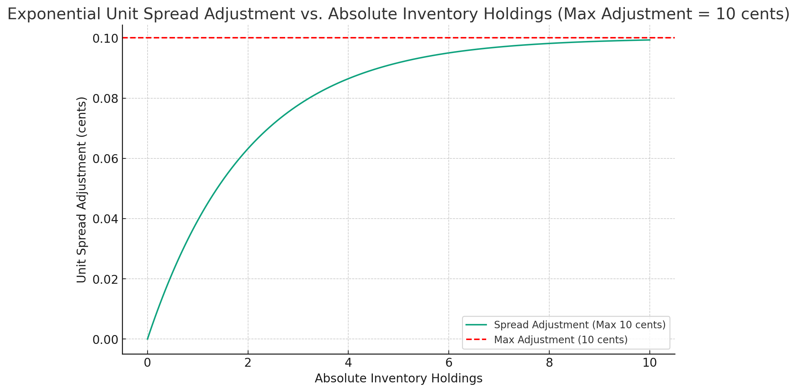

# kalshi-naive-market-maker
simple implementation of a naïve market maker adapted for the kalshi binaries exchange
_____
# introduction

the naïve market maker (NMM) is a simple liquidity provider that maintains a fixed (parameterized) spread on a single security with a simple (parameterized) inventory control mechanism and fixed (parameterized) trading quantities. the NMM attempts nash-PnL (zero trading gains/losses) and maximal inventory turnover (zero position gains/losses) and simply wants to maximize trading volume while dynamically moving the placement (not wideness) of its spread based on the last trading price and a counteractive inventory control mechanism.

the naïve market maker makes no assumptions about the true value of the underlying contract and simply attempts to maximize trading volume about a user-defined spread while mitigating inventory exposure.
_____

# description

**spread dynamics**

the naïve market maker is initialized with a fixed spread ***σ*** that is symmetrical about the last trading price ***$P_{last}$***, where:

$P_{bid}$ = $P_{last} - σ / 2$

$P_{ask}$ = $P_{last} + σ / 2$

**inventory control**

spreads are improved via the inventory control mechanism, which computes an adjustment (in cents) to apply to both sides of the spread that effectively makes accumulating inventory in the direction (long/short) of current inventory increasingly difficult up to a parameterized maximum amount. 

the inventory control mechanism is as follows:

$f(i) = -sign(i) \times M \times \left(1 - e^{-a \times |i|}\right)$

where,

- $f(i)$ is the spread adjustent in cents

- $M$ is the maximum allowed spread adjustment in cents

- $i$ is the integer value of current inventory holdings (negative for short)

- $a$ is a scaling factor for the exponential function

for example, when the max adjustment is set to 10 cents and $a$ is set to 0.5, the inventory control mechanism as a function of absolute inventory holdings would be as follows:

_____

# flaws

the naïve market maker is not intended to be and likely will not be profitable under real trading conditions. we expect it unlikely for the NMM to even achieve nash-equillibrium due to the following flaws:

1. the naïve market maker would perform poorly in competition with other market makers. the fact that its spread is constant and not reactive to the presence of other market making agents leads to a couple (not exhaustive) complications:

- the NMM will only be able to beat a sophisticated counterpart when its parameterized spread value is tighter than the counterpart is willing to go.
- sophisticated counterparts can learn of the simplicity of the NMM's behavior and exploit it in a number of different ways

2. the naïve market maker is subject to adverse selection in markets where the true value of the underlying asset is dynamic. the NMM makes no assumptions about the true value of the underlying asset and simply trades symmetrically about the last trading price (i.e. it is "naïve"). because of this, we can expect an inventory-neutral NMM to incur losses when new information is dissemenated to the market since its only protection against deltas in the true value is its inventory control mechanism. environments with volatile and real (informed rather than noisy) deltas to the underlying true value should be very unprofitable for the naïve market maker.

3. spreads are fixed and not dynamic, preventing efficient behavior in volatile and/or competitive environments.

custom adaptations to our code should take the above into account. the NMM is not intended to be profitable and was created as an exemplar for simple inventory-controlling liquidity provision.